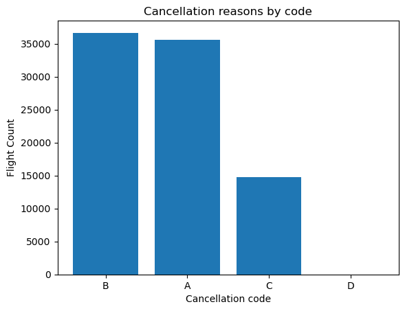
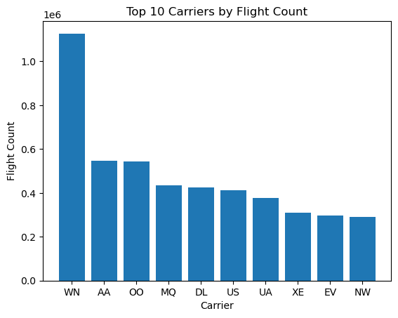
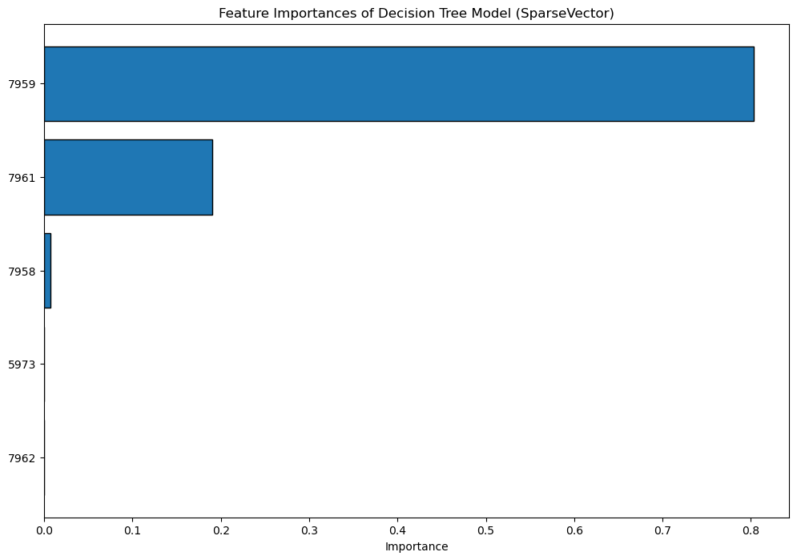

# BigData 2025 Projects Repository

Project [Big Data](https://courses.cs.ut.ee/2025/bdm/spring/Main/HomePage) is provided by [University of Tartu](https://courses.cs.ut.ee/).

Students: Marielle Lepson, Karel Paan, Andre Ahuna, Aksel Õim

# Project 4: Airline Delay and Cancellation Prediction with Spark ML

## Data
The 2009.csv and 2010.csv data file contains information of U.S. domestic airline flights in 2009. 
Each row represents a single flight and it includes information such as flight date, airline, flight number, origin and destination airports, scheduled and actual times,
delays, cancellation and etc.

The project's data is in cvs file named `2009.csv`. 

The full data file can be obtained via this [link](https://drive.google.com/file/d/1trFtRCe3xPBLr90hIWBF__OqppEnJPR_/view?usp=sharing).

### Flight Interconnected Data 
Columns:

FL_DATE: Flight date, represents the date of the flight  
Example: 2009-01-01

OP_CARRIER: Carrier code, the airline operating the flight  
Example: XE

OP_CARRIER_FL_NUM: Flight number assigned by the carrier  
Example: 1204

ORIGIN: Departure airport code  
Example: DCA

DEST: Arrival airport code  
Example: EWR

CRS_DEP_TIME: Scheduled departure time  
Example: 1100

DEP_TIME: Actual departure time  
Example: 1058.0

DEP_DELAY: Departure delay in minutes. Negative if early  
Example: -2.0

TAXI_OUT: Taxi-out time in minutes (gate to takeoff)  
Example: 18.0

WHEELS_OFF: Time when wheels left the ground  
Example: 1116.0

WHEELS_ON: Time when wheels touched down  
Example: 1158.0

TAXI_IN: Taxi-in time in minutes  
Example: 8.0

CRS_ARR_TIME: Scheduled arrival time  
Example: 1202

ARR_TIME: Actual arrival time  
Example: 1206.0

ARR_DELAY: Arrival delay in minutes. Negative if early  
Example: 4.0

CANCELLED: Whether the flight was canceled (1.0 = yes, 0.0 = no)  
Example: 0.0

CANCELLATION_CODE: Reason for cancellation  
Example: A (Carrier)

DIVERTED: Whether the flight was diverted (1.0 = yes, 0.0 = no)  
Example: 0.0

CRS_ELAPSED_TIME: Scheduled flight duration in minutes  
Example: 62.0

ACTUAL_ELAPSED_TIME: Actual flight duration in minutes  
Example: 68.0

AIR_TIME: Time spent in the air (minutes)  
Example: 42.0

DISTANCE: Flight distance in miles  
Example: 199.0

CARRIER_DELAY: Delay caused by the airline  
Example: null or 15.0

WEATHER_DELAY: Delay caused by weather conditions  
Example: null or 10.0

NAS_DELAY: Delay caused by National Airspace System  
Example: null or 5.0

SECURITY_DELAY: Delay due to security reasons  
Example: null or 0.0

LATE_AIRCRAFT_DELAY: Delay due to a previous flight arriving late  
Example: null or 20.0

Unnamed: 27: Extra column with all values as null

## Requirements

### Software, libraries and data files
Software:
- Docker
- Jupyter Notebook
- Docker Compose

Data Files:  
- A CSV file that consists of flight data, named `2009.csv`. The file size is 792,6 MB.
- A CSV file that consists of flight data, named `2010.csv`. The file size is 794,2 MB.

Data folder view (other files are from other projects, but most important is 2009.csv): 

### Setup
- Save csv file to /data location
- Navigate to project3 directory `cd project4`
- Run Docker compose file from project directory: `docker compose up -d`.
- Access the project on http://localhost:8891/lab/tree/notebook.ipynb

## Queries 
### Task 1
1. PySpark Session Setup
2. Data loading and Processing
3. Optimizing storage format
4. Data Preparation

### Task 2
1. Column Renaming:
2. Feature Engineering:
3. Data Cleaning:
4. Data Validation:

### Task 3
1. Carrier Analysis
2. Cancellation Analysis
3. Class Distribution Analysis

### Task 4
1. Setup and Imports
2. Data Type Conversion
3. Feature Selection and Organization
4. Feature Transformation Pipeline
5. Pipeline Execution
6. Feature Verification and Documentation

Feature Selection Decisions:

1. Categorical Features:
   - UniqueCarrier: Different airlines have different performance metrics
   - Origin/Destination: Airports have different weather patterns
   - FlightNum: Flight numbers may correlate with specific routes or aircraft types

2. Temporal Features:
   - DayOfWeek: Flight patterns vary by day of the week
   - Month: Seasonal variations in flight performance

3. Numerical Features:
   - Distance: Directly impacts flight time and potential for delays
   - TaxiOut/TaxiIn: Airport ground operations time
   - ScheduledElapsedTime: Baseline for expected flight duration
   - AirTime: Actual time in the air
   - DepartureDelay: Delays at departure often impact arrival time

4. Features Not Selected:
   - FlightDate: Redundant with DayOfWeek and Month
   - ScheduledDepartureTime/ArrivalTime: Could be useful but would need 
     time-of-day extraction first (e.g., morning vs. evening flights)
   - Cancelled and Diverted: Records are already filtered for these
   - WheelsOff/WheelsOn: Redundant with other time metrics
   - CarrierDelay, WeatherDelay, NASDelay, SecurityDelay, LateAircraftDelay: 
     These would cause data leakage if predicting arrival delays as they're only 
     known after a flight is completed

5. Data Type Handling:
   - Most numerical columns are stored as strings in the dataset
   - Added preprocessing step to convert string columns to proper numeric types

6. Preprocessing Pipeline:
   - Preprocessing: Convert string columns to appropriate numeric types
   - StringIndexer: Converts categorical strings to numerical indices
   - OneHotEncoder: Creates binary vectors to properly represent categorical data
   - VectorAssembler: Combines all features into a single feature vector for modeling

### Task 5
1. Label Creation
2. Train-Test Split
3. Performance Optimization
4. Evaluation Setup

### Task 6

### Task 7
Scoring the pipelined model on 2010.csv data.

### License
Licensed under the Apache 2.0 License.
